---
tags:
  - breadboard/phase/1
title: CourseCrafter
---

# CourseCrafter

> [!NOTE]
> Merging multiple docs into a learning path

- [github.com/ExaDev/samples/CourseCrafter](https://github.com/ExaDev/breadboard-samples/tree/develop/samples/CourseCrafter)
- [CourseCrafter New Syntax](https://github.com/ExaDev/breadboard-samples/tree/recreating-course-crafter-in-new-syntax/samples/CourseCrafter)

##### CourseCrafter Single Source

[github.com/samples/CourseCrafter/src/single](https://github.com/ExaDev/breadboard-samples/tree/recreating-course-crafter-in-new-syntax/samples/CourseCrafter/src/single)

##### CourseCrafter Multi-Source

[github.com/samples/CourseCrafter/src/multiple](https://github.com/ExaDev/breadboard-samples/tree/recreating-course-crafter-in-new-syntax/samples/CourseCrafter/src/multiple)

