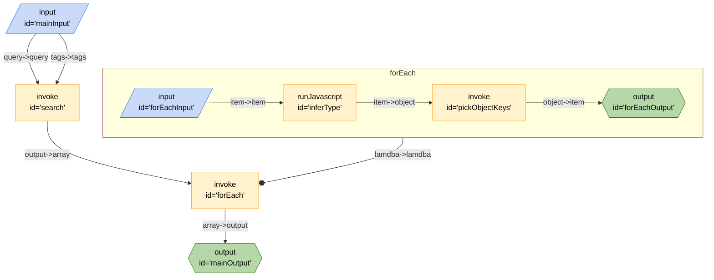

---
title:
aliases: []
tags:
  - breadboard/phase/2
  - hacker_news
created: 2024-06-13T09:13:26
modified: 2024-06-14T12:14:30
---

This is a board that simplifies the response from the [Hacker News Algolia Search](projects/Breadboard/Phase%202/Hacker%20News%20Algolia%20Search.md) board. This is achieved by invoking the search and passing the array of results to an instance of the [Board for Each](projects/Breadboard/Phase%202/Board%20for%20Each.md) board.

The [Board for Each](projects/Breadboard/Phase%202/Board%20for%20Each.md) board is passed the array and a board to manipulate each item in the array. The `$board` parameter in this case is an anonymous board that first infers the type of the item (e.g. `post` or `comment`), and then passes the the item to an instance of the [Object Manipulator Board](projects/Breadboard/Phase%202/Object%20Manipulator%20Board.md) which picks out the desired attributes.

The `forEach` board than accumulates the items and emits the complete manipulated array.

## Responses

### Full Response

The full verbose output of the Algolia Search is as follows:

```json
[
  {
    "_highlightResult": {
      "author": {
        "matchLevel": "none",
        "matchedWords": [],
        "value": "runesoerensen"
      },
      "title": {
        "fullyHighlighted": false,
        "matchLevel": "full",
        "matchedWords": [
          "artificial",
          "intelligence"
        ],
        "value": "Using <em>Artificial</em> <em>Intelligence</em> to Augment Human <em>Intelligence</em>"
      },
      "url": {
        "matchLevel": "none",
        "matchedWords": [],
        "value": "https://distill.pub/2017/aia/"
      }
    },
    "_tags": [
      "story",
      "author_runesoerensen",
      "story_15850254"
    ],
    "author": "runesoerensen",
    "children": [
      15850455,
      15850526,
      15850542,
      15850598,
      15850715,
      15850797,
      15854811
    ],
    "created_at": "2017-12-05T06:56:57Z",
    "created_at_i": 1512457017,
    "num_comments": 30,
    "objectID": "15850254",
    "points": 254,
    "story_id": 15850254,
    "title": "Using Artificial Intelligence to Augment Human Intelligence",
    "updated_at": "2023-09-07T03:31:26Z",
    "url": "https://distill.pub/2017/aia/"
  },
]
```

### Simplified Response

```json
[
 {
  "author": "runesoerensen",
  "created_at": "2017-12-05T06:56:57Z",
  "num_comments": 30,
  "objectID": "15850254",
  "points": 254,
  "story_id": 15850254,
  "title": "Using Artificial Intelligence to Augment Human Intelligence",
  "updated_at": "2023-09-07T03:31:26Z",
  "url": "https://distill.pub/2017/aia/",
  "objectType": "story"
 }
]
```

## Mermaid Diagram



## Source

- [JSON](https://github.com/ExaDev/breadboard/blob/hackernews-simplified/packages/breadboard-web/public/graphs/hacker-news-simplified-algolia-search.json)
- [TypeScript](https://github.com/ExaDev/breadboard/blob/hackernews-simplified/packages/breadboard-web/src/boards/hacker-news-simplified-algolia-search.ts)
- [Open in Breadboard Web](https://breadboard-ai.web.app/?board=https://raw.githubusercontent.com/ExaDev/breadboard/hackernews-simplified/packages/breadboard-web/public/graphs/hacker-news-simplified-algolia-search.json)

## Preview Mode

<iframe src="https://breadboard-ai.web.app/?board=https://raw.githubusercontent.com/ExaDev/breadboard/hackernews-simplified/packages/breadboard-web/public/graphs/hacker-news-simplified-algolia-search.json&embed" style="width: 100%; height: 500px; border: 0;"></iframe>

## Edit Mode

<iframe src="https://breadboard-ai.web.app/?board=https://raw.githubusercontent.com/ExaDev/breadboard/hackernews-simplified/packages/breadboard-web/public/graphs/hacker-news-simplified-algolia-search.json" style="width: 100%; height: 500px; border: 0;"></iframe>
