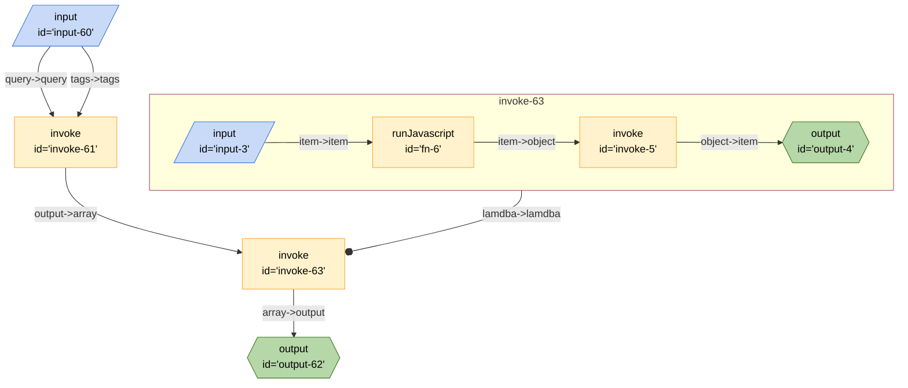

## Responses

### Full Response

The full verbose output of the Algolia Search is as follows:

```json
[
	{
		"_highlightResult": {
			"author": {
				"matchLevel": "none",
				"matchedWords": [],
				"value": "applecore"
			},
			"title": {
				"fullyHighlighted": false,
				"matchLevel": "full",
				"matchedWords": ["artificial", "intelligence"],
				"value": "Mark Cuban on Why You Need to Study <em>Artificial</em> <em>Intelligence</em>"
			},
			"url": {
				"fullyHighlighted": false,
				"matchLevel": "full",
				"matchedWords": ["artificial", "intelligence"],
				"value": "https://bothsidesofthetable.com/mark-cuban-on-why-you-need-to-study-<em>artificial</em>-<em>intelligence</em>-or-youll-be-a-dinosaur-in-3-years-db3447bea1b4"
			}
		},
		"_tags": ["story", "author_applecore", "story_13599074"],
		"author": "applecore",
		"children": [13599348, 13605406],
		"created_at": "2017-02-08T15:44:14Z",
		"created_at_i": 1486568654,
		"num_comments": 130,
		"objectID": "13599074",
		"points": 191,
		"story_id": 13599074,
		"title": "Mark Cuban on Why You Need to Study Artificial Intelligence",
		"updated_at": "2023-09-07T01:45:01Z",
		"url": "https://bothsidesofthetable.com/mark-cuban-on-why-you-need-to-study-artificial-intelligence-or-youll-be-a-dinosaur-in-3-years-db3447bea1b4"
	}
]
```

### Simplified Response

```json
[
	{
		"created_at": "2017-02-08T15:44:14Z",
		"num_comments": 130,
		"objectID": "13599074",
		"points": 191,
		"story_id": 13599074,
		"title": "Mark Cuban on Why You Need to Study Artificial Intelligence",
		"updated_at": "2023-09-07T01:45:01Z",
		"url": "https://bothsidesofthetable.com/mark-cuban-on-why-you-need-to-study-artificial-intelligence-or-youll-be-a-dinosaur-in-3-years-db3447bea1b4"
	}
]
```

## Simplified Board
- Algolia Simplified Search
	- Inputs:
		- `tags`:
			- `post`
			- `comment`
			- etc...
		- `query`
	- Outputs
		- `created_at`
		- `num_comments`
		- `story_id` < *unsure about how best to handle with non-post queries*
## Mermaid Diagram



## Source

- [JSON](https://github.com/ExaDev/breadboard/blob/hackernews-simplified/packages/breadboard-web/public/graphs/hacker-news-simplified-algolia-search.json)
- [TypeScript](https://github.com/ExaDev/breadboard/blob/hackernews-simplified/packages/breadboard-web/src/boards/hacker-news-simplified-algolia-search.ts)
- [Open in Breadboard Web](https://breadboard-ai.web.app/?board=https://raw.githubusercontent.com/ExaDev/breadboard/hackernews-simplified/packages/breadboard-web/public/graphs/hacker-news-simplified-algolia-search.json)

## Preview Mode

<iframe src="https://breadboard-ai.web.app/?board=https://raw.githubusercontent.com/ExaDev/breadboard/hackernews-simplified/packages/breadboard-web/public/graphs/hacker-news-simplified-algolia-search.json&embed" style="width: 100%; height: 500px; border: 0;"></iframe>

## Edit Mode

<iframe src="https://breadboard-ai.web.app/?board=https://raw.githubusercontent.com/ExaDev/breadboard/hackernews-simplified/packages/breadboard-web/public/graphs/hacker-news-simplified-algolia-search.json" style="width: 100%; height: 500px; border: 0;"></iframe>
****
